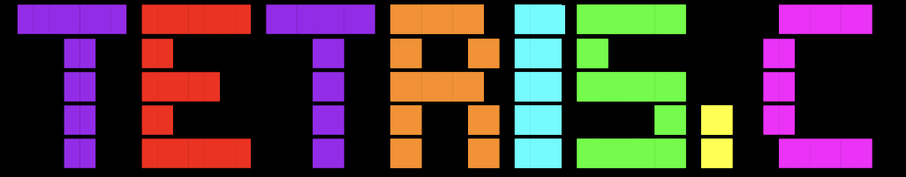
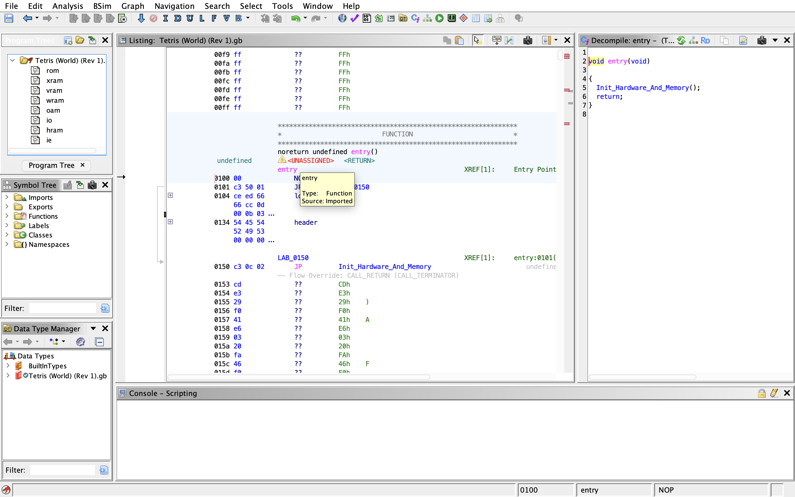
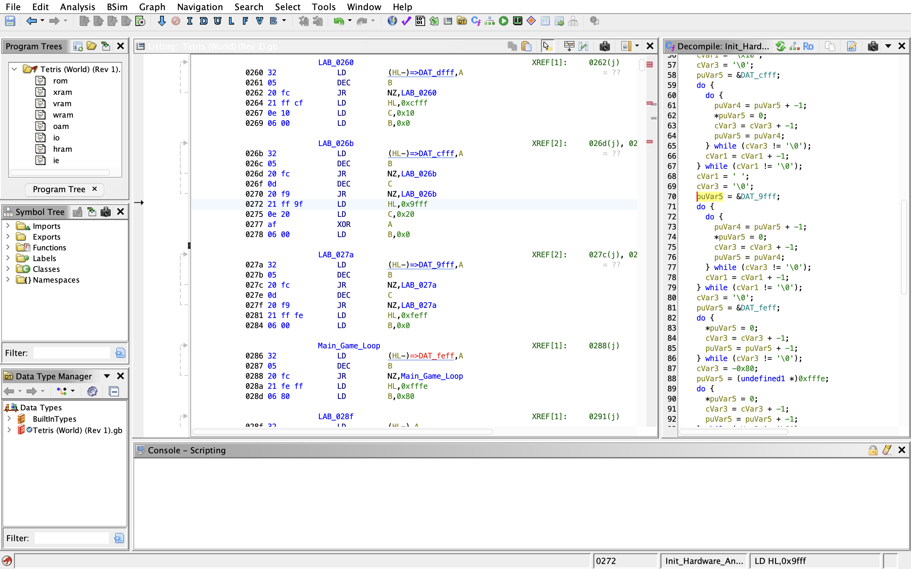
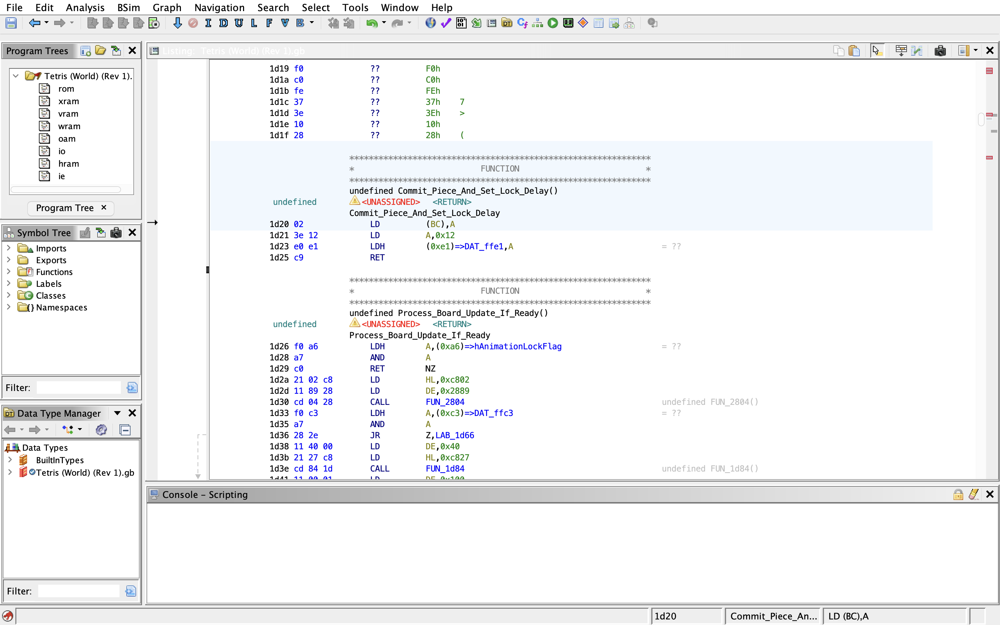
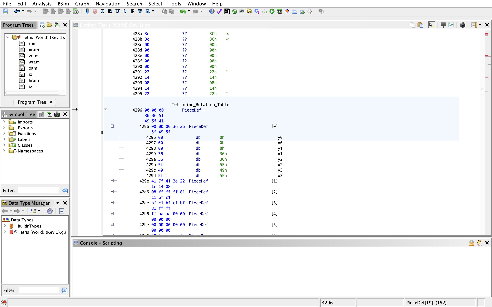
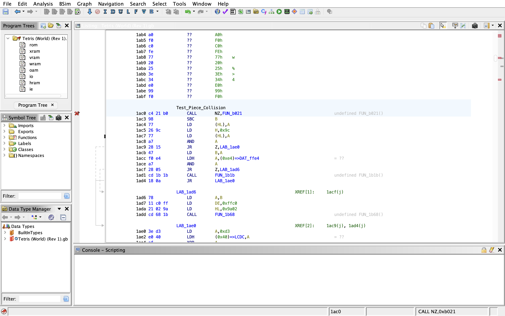
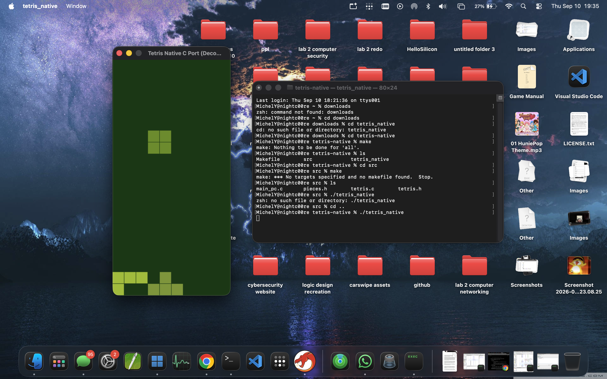

<p align="center">
  
</p>

# TETRIS.C

This project details the manual reverse engineering work I completed using the Tetris ROM using ghidra, culminating into a clean C port on Apple silicon mac[cite: 1, 2]. Instead of using an emulator or a decomp script, I wanted to study the architecture of the Sharp SM83 processor, looking for hardware quirks, its memory mapping constraints, and other operations like lookup tables and Vram blanking that are occurring under the hood[cite: 1, 2].

My findings pointed to a certain hex address 0x0100[cite: 1, 2]. Upon disassembling the program, I deciphered that this was the entry point of the ROM[cite: 1, 2]. Growing up I always remembered the iconic nintendo logo playing before each game[cite: 1, 2]. This was no accident, as the boot rom writes to address 0xFF50, then jumps over to 0x0100 as soon as the sequence finishes[cite: 1, 2]. It was a strict anti piracy or anti counterfeit measure to protect the Nintendo IP[cite: 1, 2]. 

<p align="center">
  
</p>

Another thing that I notices is the sequential memory loops[cite: 1, 2]. The hardware seems to be initializing SRAM, VRAM, and ORAM in this order[cite: 1, 2]. From my findings, it starts with the SRAM, then the WORK ram (0xC000), then the VRAM (0x8000), and OAM (0xFE00)[cite: 1, 2]. This is just purely electrical noise[cite: 1, 2]. Usually an operating system filters them out when the hardware is initializing, but the gameboy cartridge is solely responsible for carrying out this filtering[cite: 1, 2].

<p align="center">
  
</p>

Because of the limitations of the SHARP SM83 processor and the PPU unit of the gameboy, you could not write to the Vram whenever[cite: 1, 2]. If the screen is drawing pixels as the CPU fetches more instructions, the screen will v blank[cite: 1, 2]. This causes visual glitches such as screen tearing[cite: 1, 2]. Because of this hardware quirk, the game does a massive wipe during the boot while the LCD is turned off[cite: 1, 2]. On my m1 mac with its ultra fast unified memory, I didnt need to include this in the source code[cite: 1, 2]. But understanding why the GameBoy did this was a crucial part in my reverse engineering[cite: 1, 2].

Starting at the hardware address 0x1D20, the Gameboy maps out the playfield of blocks into the workram as a linear byte array consisting of a 10x20 grid[cite: 1, 2]. The routine starts at address 0x1d29, and the processor initializes an inner counter LD B, 10 (the 10 grid cells per row) and walks backwards through memory checking each cell[cite: 1, 2].

<p align="center">
  
</p>

The address 0x1AC0 in Ghidra also starts state validation checks[cite: 1, 2]. In tetris terms, whenever a player presses left, right, up, or down, it does not change the gamestate on the fly[cite: 1, 2]. It takes the candidate rotation (X, Y)[cite: 1, 2]. It looks up the 4 block offsets from the function we discovered (Tetromino_Rotation_Table) in our source code, calculator target cell, testing for wall bounds, and cell occupancy and only then will it validate the user input[cite: 1, 2]. Only if all 4 blocks pass is when the block is placed[cite: 1, 2].

<p align="center">
  
</p>

<p align="center">
  
</p>

One last interesting thing about the hardware I discovered was the nature of the Registers[cite: 1, 2]. While my M1 mac is a 64bit machine, with 31 highly dynamic registers and executes instructions out of order, the SHARP sm83 processor has all its math operations all done by its accumulator (A), or its memory pointer arithmetic witch depends on its register pairing (HL, BC, DE)[cite: 1, 2]. Other performance critical operations are conducted by its dedicated postcodes like LDH to save cycles off bus transactions, a critical bottleneck in its processor[cite: 1, 2].

Through my findings, I recreated the code in C with all this in mind[cite: 1, 2]. 

<p align="center">
  
</p>

### How to run:

```bash
# 1. Install SDL2 via Homebrew
brew install sdl2

# 2. Compile natively using clang
make

# 3. Launch the game
./tetris_native
